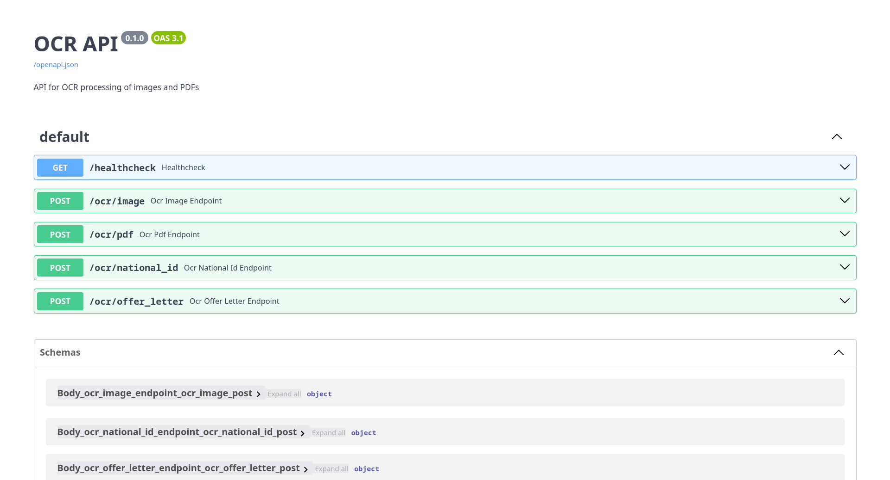

# Unstructured and Structured Image to Text OCR (Optical Character Recognition)

## Image Text OCR Endpoints

- `/healthcheck`: verify that the api is running
- `/ocr/image`: OCR endpoint for single images. Accepts an image file, text prompt and an optional system prompt and provides unstructured output.
- `/ocr/pdf`: OCR endpoint for PDF files with hybrid processing. Extracts text and embedded images, then processes each page and provides unstructured output.
- `/ocr/national_id`: OCR endpoint for National ID cards with structured output. Returns validated JSON matching NationalIDData schema.
- `/ocr/offer_letter`: OCR endpoint for Offer Letters with multi-page support and pre-processing. Returns validated JSON matching OfferLetterData schema.

## How to Run
